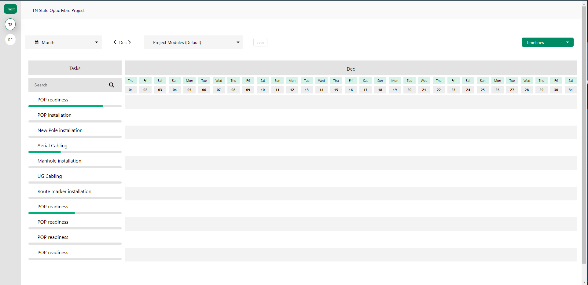

This is a Timeline component made using NextJS. Start the preview using `npm install && npm run dev`

## What is it

It's a Timeline component made to simplify tasks managing component (_Not the best optimized component_)

# How to use

In order to create a new task you'll need to double click on your timeline component in order to create a new task!
Then you'll be able to modify its position by sliding the new task controller that spawns.

# Purpose of the project

It was a freelance project it was made from scratch for specific user case the component is free to use but you'll probably need to write some more in order to make it fit your usage case.

## Screenshots

